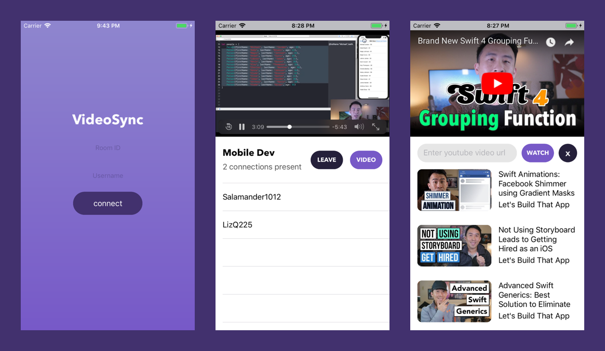

# VideoSync
An app for synchronized youtube video playback.

 

## Getting Started
These instructions will get a copy of the project up and running on your local machine.

### Prerequisites
Make sure you have Xcode as well as the following dependencies installed before cloning the repo

- Cocoapods
- Node.js

You can install Cocoapods using the following command  
`sudo gem install cocoapods`

To install Node go [here][1] and follow the download instructions.
[1]: https://nodejs.org/en/ "Title"

## Server Dependencies

[Node.js](https://nodejs.org/en/)  
[Express.js](https://expressjs.com/)  
[Socket.io](https://socket.io/)  

## Mobile Dependencies

[SocketIO Swift Client](https://github.com/socketio/socket.io-client-swift)  
[Alamofire](https://github.com/Alamofire/Alamofire)  
[Youtube Video Player](https://github.com/gilesvangruisen/Swift-YouTube-Player)  

